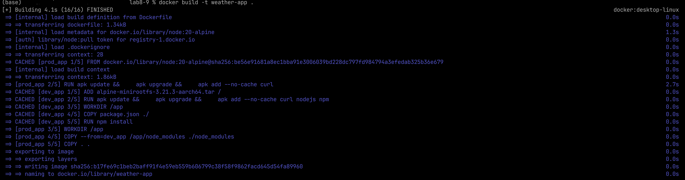
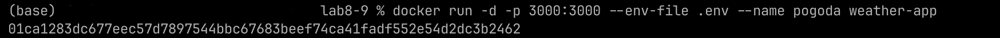
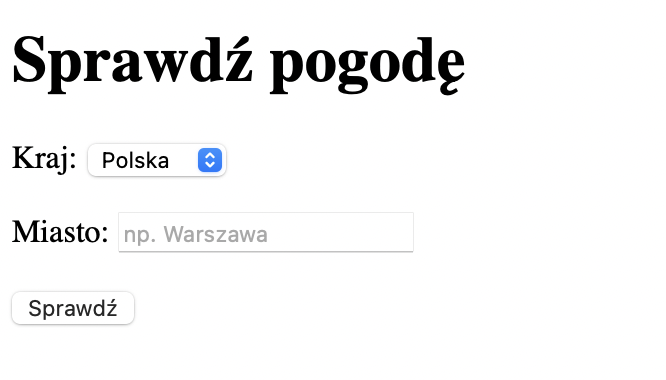
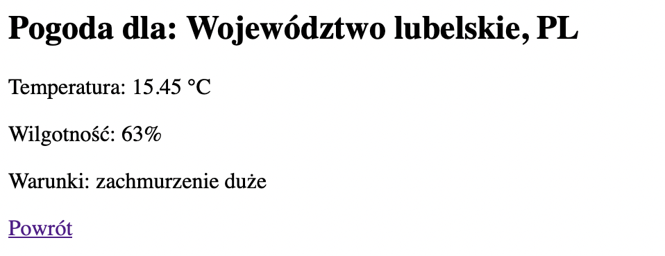
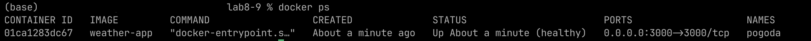
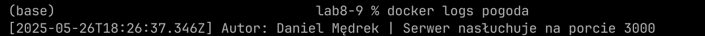
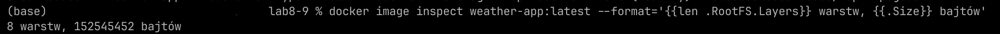

# A web application created for the eighth and ninth laboratory in cloud computing programming.

Application allows checking the weather in any of the three countries (Poland, Germany, France)

> > [!WARNING]
> Application has been built to provide information only in Polish language
---

## Table of Contents

- [Screenshots](#screenshots)
- [Installation](#installation)
- [Usage](#usage)

---

## Screenshots















---

## Installation

```bash
git clone https://github.com/MedrekIT/cloud_lab8-9.git
cd cloud_lab8-9
```

> > [!WARNING]
> To make it work, you will need to install suitable image from [Alpine page](https://www.alpinelinux.org/downloads/) or change to desired image in your [Dockerfile](./Dockerfile)
> Also, you will need to provide your own API key from [OpenWeather page](https://openweathermap.org/api) to your [".env" file](./.env)

---

## Usage

*Build*
```bash
docker build -t weather-app .
```

*Run*
```bash
docker run -d -p 3000:3000 --env-file .env --name pogoda weather-app
```

*Test*
```bash
curl localhost:3000
```

*Get logs*
```bash
docker logs pogoda
```

*Get image layers info*
```bash
docker image inspect weather-app:latest --format='{{len .RootFS.Layers}} warstw, {{.Size}} bajtów'
```
